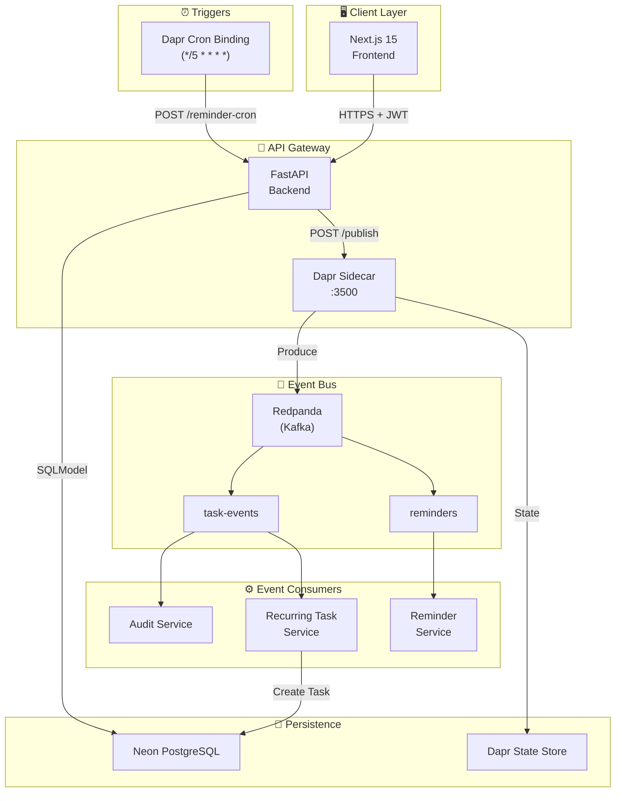

# 🚀 Evolution of Todo: Spec-Driven AI Architecture

<div align="center">

[](./specs/)
[](./frontend/)
[](./backend/)
[](./dapr/)
[](./docker-compose.yaml)
[](./backend/)

**A Todo App that Evolves from Console → Web → AI Chatbot → Kubernetes → Event-Driven**

*Hackathon II: Spec-Driven Development*

[View Specs](#-spec-driven-proof) • [Quick Start](#-quick-start) • [Architecture](#-architecture) • [Phases](#-the-evolution-story)

</div>

---

## 📖 The Evolution Story

This project demonstrates how a simple todo app can evolve through **5 architectural phases** while maintaining strict **Spec-Driven Development** methodology.

| Phase | Evolution | Technology |
|-------|-----------|------------|
| **I** | Console CLI | Python 3.13, In-Memory Storage |
| **II** | Full-Stack Web | Next.js 15, FastAPI, Neon PostgreSQL, Better Auth JWT |
| **III** | AI Chatbot | OpenAI Agents SDK, MCP Tools, Stateless Architecture |
| **IV** | Kubernetes | Docker, Helm Charts, Minikube |
| **V** | Event-Driven | Dapr Sidecars, Redpanda (Kafka), Recurring Tasks |

---

## 🏗️ Architecture

### Phase V: Distributed Event-Driven Architecture



### Key Architectural Decisions

- **Loose Coupling**: No direct Kafka imports—all events via Dapr HTTP sidecar
- **Stateless Chat**: No in-memory conversation state; all history in PostgreSQL
- **User Isolation**: Every SQL query filtered by `user_id`

---

## 📋 Spec-Driven Proof

This project strictly follows **Spec-Driven Development**. All code was generated from specifications.

### Spec-Kit Configuration
```yaml
# .spec-kit/config.yaml
structure:
  specs_dir: specs
  features_dir: specs/features
  api_dir: specs/api
  database_dir: specs/database
  ui_dir: specs/ui
```

### Specification Files

| Spec | Purpose | Link |
|------|---------|------|
| `task-crud.md` | User Stories & Acceptance Criteria | [View](./specs/features/task-crud.md) |
| `authentication.md` | JWT & Better Auth flow | [View](./specs/features/authentication.md) |
| `chatbot.md` | AI Agent & MCP Tools | [View](./specs/features/chatbot.md) |
| `event-driven.md` | Dapr & Kafka architecture | [View](./specs/features/event-driven.md) |
| `rest-endpoints.md` | API contracts | [View](./specs/api/rest-endpoints.md) |
| `mcp-tools.md` | AI tool definitions | [View](./specs/api/mcp-tools.md) |
| `async-events.md` | Event schemas | [View](./specs/api/async-events.md) |
| `schema.md` | Database models | [View](./specs/database/schema.md) |

---

## 🚀 Quick Start

### Prerequisites
- Docker & Docker Compose
- Node.js 20+ (for frontend dev)
- Python 3.13+ with UV (for backend dev)

### Run with Docker Compose (Recommended)

```bash
# 1. Clone the repository
git clone https://github.com/your-repo/evolution-of-todo.git
cd evolution-of-todo

# 2. Create environment file
cp backend/.env.example .env

# 3. Edit .env with your credentials
# DATABASE_URL=postgresql+asyncpg://...
# BETTER_AUTH_SECRET=your-secret
# OPENAI_API_KEY=sk-...

# 4. Start all services (includes Redpanda)
docker-compose up --build

# 5. Access the app
# Frontend: http://localhost:3000
# Backend API: http://localhost:8000/docs
# Redpanda Console: http://localhost:8082
```

### Local Development

```bash
# Backend
cd backend
uv sync
uv run uvicorn src.main:app --reload

# Frontend
cd frontend
npm install
npm run dev
```

---

## 📁 Project Structure

```
evolution-of-todo/
├── .spec-kit/              # Spec-Kit configuration
│   └── config.yaml
├── specs/                  # 📋 All specifications
│   ├── features/           # Feature specs with User Stories
│   ├── api/                # API & event specifications
│   ├── database/           # Schema specifications
│   └── ui/                 # Component specifications
├── frontend/               # 🖥️ Next.js 15 App
│   ├── app/                # App Router pages
│   ├── lib/                # API client, auth
│   └── Dockerfile
├── backend/                # ⚙️ FastAPI Server
│   ├── src/
│   │   ├── routes/         # API endpoints
│   │   ├── events.py       # Dapr publisher
│   │   ├── agent.py        # AI chatbot
│   │   └── mcp_tools.py    # MCP tools
│   └── Dockerfile
├── dapr/                   # 📡 Dapr components
│   └── components/
│       ├── pubsub.yaml     # Kafka/Redpanda
│       ├── statestore.yaml # PostgreSQL
│       └── cron-binding.yaml
├── helm/                   # ☸️ Kubernetes Helm charts
│   └── todo-evolution/
├── .github/workflows/      # 🚀 CI/CD
│   └── deploy.yml
├── docker-compose.yaml     # Local dev with Redpanda
├── CLAUDE.md               # AI assistant instructions
└── DEPLOYMENT.md           # Kubernetes deployment guide
```

---

## ✨ Features

### Phase I: Console CLI
- ✅ Add, View, Update, Delete tasks
- ✅ Mark tasks complete/incomplete
- ✅ In-memory storage (no database)

### Phase II: Full-Stack Web
- ✅ User authentication with Better Auth + JWT
- ✅ User-scoped API: `/api/{user_id}/tasks`
- ✅ SQLModel ORM with Neon PostgreSQL
- ✅ Responsive Next.js dashboard

### Phase III: AI Chatbot
- ✅ Natural language task management
- ✅ "What's pending?" → `list_tasks(status="pending")`
- ✅ Stateless architecture (no in-memory state)
- ✅ 5 MCP tools: add, list, complete, delete, update

### Phase IV: Kubernetes
- ✅ Multi-stage Dockerfiles
- ✅ Helm charts with configurable secrets
- ✅ Minikube deployment guide
- ✅ AI-Powered Tools: kubectl-ai, kagent, Docker Gordon
- 📚 [AI Tools Guide](./docs/AI-K8S-TOOLS.md) | [Deployment Guide](./DEPLOYMENT.md)

### Phase V: Event-Driven
- ✅ Dapr pub/sub (no direct Kafka imports)
- ✅ Task events: Created, Updated, Deleted, Completed
- ✅ Recurring task automation
- ✅ Cron-based reminders (every 5 min)
- ✅ Audit logging
- ✅ All 5 Dapr Building Blocks (Pub/Sub, State, Bindings, Service Invocation, Secrets)
- 📚 [Architecture](./docs/ARCHITECTURE.md) | [Monitoring](./docs/MONITORING.md) | [Load Testing](./docs/LOAD-TESTING.md)

---

## 🔧 API Endpoints

| Method | Endpoint | Description |
|--------|----------|-------------|
| `GET` | `/api/{user_id}/tasks` | List tasks |
| `POST` | `/api/{user_id}/tasks` | Create task |
| `PUT` | `/api/{user_id}/tasks/{id}` | Update task |
| `DELETE` | `/api/{user_id}/tasks/{id}` | Delete task |
| `PATCH` | `/api/{user_id}/tasks/{id}/complete` | Toggle complete |
| `POST` | `/api/{user_id}/chat` | AI chatbot |
| `GET` | `/dapr/subscribe` | Dapr subscriptions |
| `POST` | `/events/task-events` | Event handler |
| `POST` | `/reminder-cron` | Cron trigger |

---

## 🏆 Hackathon Compliance

| Requirement | Status |
|-------------|--------|
| Spec-Driven Development | ✅ `.spec-kit/config.yaml` + `specs/` folder |
| Monorepo Structure | ✅ `/frontend`, `/backend`, `/CLAUDE.md` |
| User Stories & Acceptance Criteria | ✅ `specs/features/task-crud.md` |
| Better Auth + JWT Middleware | ✅ `backend/src/auth.py` |
| User Isolation (user_id filtering) | ✅ `backend/src/crud.py` |
| Stateless Chat Architecture | ✅ `backend/src/routes/chat.py` |
| MCP Tools | ✅ `backend/src/mcp_tools.py` |
| Dapr (No direct Kafka) | ✅ `backend/src/events.py` |
| Helm Charts | ✅ `helm/todo-evolution/` |
| CI/CD Pipeline | ✅ `.github/workflows/deploy.yml` |

---

## 📄 License

MIT License - See [LICENSE](./LICENSE)

---

<div align="center">

**Built for Hackathon II: Spec-Driven Development**

*Evolution of Todo - From Console to Cloud*

</div>
